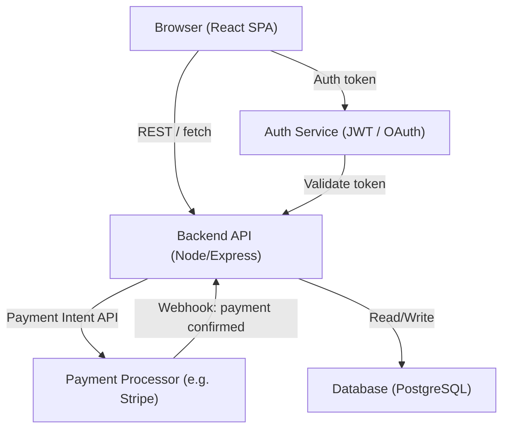

# Design Document: Matcha Ordering App

## Overview

A TypeScript-based mobile-first web application for a local matcha business. Customers browse the menu, customize drinks, place pickup orders, and track status. The app supports both guest and authenticated checkout, with fast reorder for signed-in customers.

Key design priorities:
- Mobile-first, single-column layout optimized for 390px screens
- Secure payment via external Payment Processor (no raw card storage)
- Idempotent order creation — orders only created on confirmed payment
- Cart persisted in sessionStorage across page refreshes
- Pickup time slot enforcement (10-min prep, operating hours, stale slot detection)
- Tip selection at checkout with preset percentages and custom amount; defaults to 0
- Default slot capacity is 5 total items; Store_Admin can override per slot; orders rejected if adding them would exceed capacity
- Venmo payments use a client-side deep-link; orders are created server-side with `pending_payment` status and require manual Store_Admin confirmation.

---

## Architecture

The app follows a client-side SPA architecture with a lightweight backend API layer for order management, payment orchestration, and auth.



**Key architectural decisions:**

- Order creation happens server-side only after a webhook/callback from the Payment Processor confirms payment. The client never directly creates orders.
- Idempotency keys are attached to payment requests to prevent duplicate order creation on retries.
- Cart state lives in `sessionStorage` on the client — no server-side cart persistence needed for MVP.
- Auth is optional at checkout; guest orders are supported. Order history requires a signed-in session.
- Venmo payments use a client-side deep-link; orders are created server-side with `pending_payment` status and require manual Store_Admin confirmation.

---

## Components and Interfaces

### Frontend Components

```
src/
  components/
    Menu/
      MenuPage.tsx          # Category-filtered menu grid
      MenuItemCard.tsx       # Item display with out-of-stock state
      CustomizationModal.tsx # Customization selection + price update
    Cart/
      CartDrawer.tsx         # Slide-in cart with line items
      CartSummary.tsx        # Subtotal / tax / total display
    Checkout/
      CheckoutPage.tsx       # Order summary + time slot + payment
      TimeSlotPicker.tsx     # Available pickup slots
      TipSelector.tsx        # Preset tip buttons (10%, 15%, 20%) + custom amount input
      PaymentForm.tsx        # Payment Processor hosted fields
      VenmoPaymentButton.tsx # Deep-link button to Venmo with pre-filled order total
    Orders/
      OrderConfirmation.tsx  # Post-payment confirmation screen
      OrderStatusPage.tsx    # Live order status display
      OrderHistoryPage.tsx   # Past orders list (auth-gated)
      ReorderButton.tsx      # Triggers reorder flow
    Auth/
      AuthModal.tsx          # Sign-in / guest choice modal
    Admin/
      SlotCapacityPage.tsx   # Store_Admin UI to view and update slot capacities
  hooks/
    useCart.ts               # Cart state + sessionStorage sync
    usePickupSlots.ts        # Fetch + validate time slots
    useOrderStatus.ts        # Poll or subscribe to order status
  services/
    api.ts                   # Typed fetch wrappers for backend routes
    payment.ts               # Payment Processor SDK integration
```

### Backend Routes

| Method | Path | Description |
|--------|------|-------------|
| GET | `/menu` | Fetch all menu items with categories |
| GET | `/pickup-slots` | Available pickup time slots |
| POST | `/checkout/intent` | Create payment intent (idempotency key required) |
| POST | `/webhook/payment` | Payment Processor webhook — creates order on success |
| GET | `/orders/:id` | Fetch order by ID |
| GET | `/orders/history` | Customer order history (auth required) |
| POST | `/orders/:id/reorder` | Validate and return reorder cart payload |
| PATCH | `/admin/pickup-slots/:id/capacity` | Update slot capacity (Store_Admin only) |
| GET | `/admin/pickup-slots` | List all slots with current usage (Store_Admin only) |
| POST | `/admin/orders/:id/confirm-payment` | Store_Admin manually confirms Venmo payment receipt |

### Key Interfaces (TypeScript)

```typescript
interface MenuItem {
  id: string;
  name: string;
  description: string;
  basePrice: number;
  category: "drinks" | "food" | "extras";
  inStock: boolean;
  customizations: CustomizationGroup[];
}

interface CustomizationGroup {
  id: string;
  label: string;
  required: boolean;
  options: CustomizationOption[];
}

interface CustomizationOption {
  id: string;
  label: string;
  priceDelta: number; // positive or negative cents
}

interface CartItem {
  menuItemId: string;
  name: string;
  quantity: number;
  selectedCustomizations: Record<string, string>; // groupId -> optionId
  unitPrice: number; // resolved at add-to-cart time
}

interface Cart {
  items: CartItem[];
  subtotal: number;
  tax: number;
  tip: number;   // in cents, defaults to 0
  total: number; // subtotal + tax + tip
}

interface PickupSlot {
  id: string;
  time: string;        // ISO 8601
  capacity: number;    // max total item quantity for this slot
  usedCapacity: number; // sum of item quantities from confirmed orders
  available: boolean;  // true if usedCapacity < capacity
}

interface Order {
  id: string;
  customerId: string | null; // null for guest
  guestEmail?: string;
  items: CartItem[];
  subtotal: number;
  tax: number;
  tip: number; // in cents
  total: number;
  pickupSlotId: string;
  pickupTime: string;
  status: "pending_payment" | "received" | "preparing" | "ready";
  paymentMethod: "card" | "venmo";
  createdAt: string;
  idempotencyKey: string;
}
```

---

## Data Models

### Database Schema (PostgreSQL)

**menu_items**
```sql
id          UUID PRIMARY KEY
name        TEXT NOT NULL
description TEXT
base_price  INTEGER NOT NULL  -- cents
category    TEXT NOT NULL
in_stock    BOOLEAN DEFAULT true
```

**customization_groups**
```sql
id             UUID PRIMARY KEY
menu_item_id   UUID REFERENCES menu_items(id)
label          TEXT NOT NULL
required       BOOLEAN DEFAULT false
```

**customization_options**
```sql
id                    UUID PRIMARY KEY
customization_group_id UUID REFERENCES customization_groups(id)
label                 TEXT NOT NULL
price_delta           INTEGER DEFAULT 0  -- cents
```

**pickup_slots**
```sql
id           UUID PRIMARY KEY
slot_time    TIMESTAMPTZ NOT NULL
capacity      INTEGER NOT NULL DEFAULT 5   -- max total item quantity per slot
used_capacity INTEGER NOT NULL DEFAULT 0   -- sum of item quantities from confirmed orders
```

**orders**
```sql
id               UUID PRIMARY KEY
customer_id      UUID REFERENCES customers(id) NULL
guest_email      TEXT NULL
items_snapshot   JSONB NOT NULL   -- full cart snapshot at order time
subtotal         INTEGER NOT NULL
tax              INTEGER NOT NULL
tip              INTEGER NOT NULL DEFAULT 0  -- cents
total            INTEGER NOT NULL
pickup_slot_id   UUID REFERENCES pickup_slots(id)
status           TEXT DEFAULT 'received'  -- 'pending_payment' for Venmo orders, 'received' for card
payment_method   TEXT NOT NULL DEFAULT 'card'  -- 'card' or 'venmo'
idempotency_key  TEXT UNIQUE NOT NULL
payment_intent_id TEXT UNIQUE NOT NULL
created_at       TIMESTAMPTZ DEFAULT now()
```

Note: Venmo orders are created with `status = 'pending_payment'`; card orders are created with `status = 'received'` after webhook confirmation.

**customers**
```sql
id           UUID PRIMARY KEY
email        TEXT UNIQUE NOT NULL
password_hash TEXT NOT NULL
created_at   TIMESTAMPTZ DEFAULT now()
```

### Cart Persistence

Cart is stored client-side in `sessionStorage` as serialized JSON under the key `matcha_cart`. It is loaded on app init and written on every mutation. No server-side cart storage is required.

### Idempotency

Each checkout session generates a UUID `idempotencyKey` stored in `sessionStorage`. This key is sent with every payment intent request. The backend enforces `UNIQUE` on `orders.idempotency_key` — any retry with the same key returns the existing order rather than creating a duplicate.

### Pickup Slot Conflict Detection

When the customer reaches the confirmation step, the backend re-validates the selected `pickup_slot_id`:
1. Checks `slot_time >= now() + 10 minutes`
2. Checks `used_capacity < capacity`
3. Checks slot is within configured operating hours

Slot usage is calculated as the sum of item quantities across all confirmed orders in the slot (not capacity_units × quantity — each item counts as 1 unit per quantity).

If any check fails, the API returns a `409 Conflict` and the client prompts the customer to re-select.


---

## Correctness Properties

*A property is a characteristic or behavior that should hold true across all valid executions of a system — essentially, a formal statement about what the system should do. Properties serve as the bridge between human-readable specifications and machine-verifiable correctness guarantees.*

### Property 1: Order history access control

*For any* customer state (guest or authenticated), accessing order history should succeed if and only if the customer has a valid authenticated session.

**Validates: Requirements 1.3**

---

### Property 2: Menu category grouping

*For any* list of menu items, the category grouping function should produce groups where every item appears in exactly one group whose key matches the item's `category` field, and no items are lost or duplicated.

**Validates: Requirements 2.1**

---

### Property 3: Item detail completeness

*For any* menu item, the item detail view renderer should produce output containing the item's name, description, price, and all customization groups defined for that item.

**Validates: Requirements 2.2**

---

### Property 4: Out-of-stock items cannot be added to cart

*For any* menu item with `inStock = false`, attempting to add it to the cart should be rejected and the cart should remain unchanged.

**Validates: Requirements 2.3**

---

### Property 5: Category filter correctness

*For any* category filter value and any list of menu items, the filtered result should contain exactly those items whose `category` field matches the filter — no more, no fewer.

**Validates: Requirements 2.4**

---

### Property 6: Customization price calculation

*For any* menu item and any combination of selected customization options, the computed item price should equal `basePrice + sum(priceDelta for each selected option)`.

**Validates: Requirements 3.2**

---

### Property 7: Mandatory customization validation

*For any* menu item with N required customization groups, attempting to add it to the cart with fewer than N required groups selected should be rejected.

**Validates: Requirements 3.3**

---

### Property 8: Cart total invariant

*For any* cart state and any mutation (item addition, quantity update, or item removal), the cart's `total` should always equal `sum(unitPrice * quantity for each item) + tax + tip`, and the item count should reflect the actual items present.

**Validates: Requirements 4.1, 4.3, 4.4**

---

### Property 9: Cart line item rendering

*For any* cart item, the rendered cart row should include the item's name, all selected customization labels, quantity, and line-item price (`unitPrice * quantity`).

**Validates: Requirements 4.2**

---

### Property 10: Cart summary completeness

*For any* non-empty cart, the cart summary component should display a non-zero subtotal, a tax value, and a total equal to `subtotal + tax`.

**Validates: Requirements 4.5**

---

### Property 11: Cart sessionStorage round-trip

*For any* cart state, serializing it to `sessionStorage` and then deserializing it should produce a cart that is structurally equivalent to the original (same items, quantities, customizations, and totals).

**Validates: Requirements 4.6, 4.7**

---

### Property 12: Checkout summary completeness

*For any* non-empty cart, the checkout order summary renderer should display all cart items and totals that match the cart's `subtotal`, `tax`, and `total`.

**Validates: Requirements 5.1**

---

### Property 13: Valid pickup slot filter

*For any* list of pickup slots and any current time T, the slots offered to the customer should contain only slots where: `slot_time >= T + 10 minutes` AND `booked_count < capacity` AND `slot_time` falls within configured operating hours.

**Validates: Requirements 5.3, 5.4, 5.5**

---

### Property 14: Tax calculation correctness

*For any* cart subtotal (in cents) and configured tax rate, the computed tax should equal `round(subtotal * rate)` and the total should equal `subtotal + tax`.

**Validates: Requirements 5.7**

---

### Property 14b: Tip calculation correctness

*For any* cart subtotal, tax, and tip amount (including 0), the order total should equal `subtotal + tax + tip`. When no tip is selected, tip defaults to 0 and total equals `subtotal + tax`.

**Validates: Requirements 10.3, 10.5, 10.6**

---

### Property 15: Order created on confirmed payment

*For any* valid cart, pickup slot, and payment confirmation event from the Payment Processor, exactly one order should be created containing all cart items, correct totals, and the selected pickup time.

**Validates: Requirements 5.9, 6.6**

---

### Property 16: Empty cart blocks checkout

*For any* cart with zero items, initiating checkout should be rejected and no checkout flow should proceed.

**Validates: Requirements 5.11**

---

### Property 17: Idempotent order creation

*For any* idempotency key, submitting the same payment confirmation N times (N ≥ 1) should result in exactly one order being created — subsequent submissions should return the existing order without creating duplicates.

**Validates: Requirements 6.5**

---

### Property 18: Order confirmation rendering

*For any* confirmed order, the confirmation view should include the order number, all ordered items with their customizations, and the selected pickup time.

**Validates: Requirements 7.1**

---

### Property 19: Order history sort order

*For any* list of past orders, the order history display should present them sorted by `createdAt` descending (most recent first), with no orders omitted.

**Validates: Requirements 8.1**

---

### Property 20: Order history detail completeness

*For any* past order, the order detail view should include all items with their customizations, the order total, and the order date.

**Validates: Requirements 8.2**

---

### Property 21: Reorder cart construction

*For any* past order, triggering a reorder should produce a cart where: (a) every available item from the past order is present with its original customizations, (b) unavailable items are excluded, and (c) all item prices reflect current menu prices rather than historical prices.

**Validates: Requirements 8.3, 8.4, 8.5**

---

### Property 22: Slot capacity enforcement

*For any* pickup slot with a configured capacity C and current used capacity U, accepting a new order with total capacity units N should be allowed if and only if `U + N <= C`. Any order that would cause `U + N > C` must be rejected.

**Validates: Requirements 11.2, 11.4**

---

### Property 23: Slot usage calculation

*For any* set of confirmed orders assigned to a slot, the slot's `used_capacity` should equal `sum(item.quantity for all items across all confirmed orders in the slot)`.

**Validates: Requirements 11.4**

---

### Property 24: Venmo order status on creation

*For any* order placed via Venmo, the order should be created with `status = 'pending_payment'` and should not advance to `received` until Store_Admin explicitly confirms payment via the admin confirm-payment endpoint.

**Validates: Requirements 6.9, 6.10**

---

## Error Handling

### Venmo Payment

- If a Customer navigates away after selecting Venmo without completing payment, the order remains in `pending_payment` status. Store_Admin can cancel or confirm the order manually.

### Payment Errors

| Scenario | Behavior |
|----------|----------|
| Payment failure (card declined, etc.) | Display descriptive error from Payment Processor; allow retry or different method; cart preserved |
| Network timeout during payment | Display timeout error; cart preserved in sessionStorage; idempotency key retained for retry |
| Duplicate payment submission | Backend returns existing order via idempotency key; no duplicate created |
| Payment intent creation failure | Display error; user remains on checkout page |

### Pickup Slot Conflicts

When the backend detects a stale slot at order confirmation time (slot became full or outside hours between selection and submission), the API returns `409 Conflict` with a `SLOT_UNAVAILABLE` error code. The client clears the selected slot and re-renders the `TimeSlotPicker` with a user-facing message.

### Reorder Validation Errors

When a reorder contains unavailable items or stale customizations:
- Unavailable items: excluded from cart, customer notified with item names
- Stale customizations: item added to cart but flagged; checkout blocked until customer updates the selection

### Out-of-Stock Items

Menu items with `inStock = false` are rendered with a disabled state. Add-to-cart is blocked client-side. The backend also validates item availability at checkout to handle race conditions.

### Auth / Access Control

Unauthenticated access to `/orders/history` returns `401`. The client intercepts this and renders the `AuthModal` prompting sign-in.

### Empty Cart

The checkout button is disabled when `cart.items.length === 0`. Direct navigation to `/checkout` with an empty cart redirects to the menu page.

### Slot Capacity Exceeded

When an order would exceed slot capacity at confirmation time, the API returns `409 Conflict` with a `SLOT_CAPACITY_EXCEEDED` error code. The client prompts the customer to select a different Pickup_Time slot.

---

## Testing Strategy

### Dual Testing Approach

Both unit/example tests and property-based tests are used. Unit tests cover specific scenarios, integration points, and error cases. Property tests verify universal correctness across randomized inputs.

### Property-Based Testing

**Library**: [fast-check](https://github.com/dubzzz/fast-check) (TypeScript-native, well-maintained)

**Configuration**: Minimum 100 runs per property test (`numRuns: 100`).

Each property test is tagged with a comment referencing its design property:
```typescript
// Feature: matcha-ordering-app, Property 11: Cart sessionStorage round-trip
```

Properties to implement as PBT:

| Property | Test Focus |
|----------|-----------|
| P2: Menu category grouping | `groupByCategory(items)` pure function |
| P3: Item detail completeness | `renderItemDetail(item)` output |
| P4: Out-of-stock rejection | `addToCart(item)` guard |
| P5: Category filter correctness | `filterByCategory(items, cat)` |
| P6: Customization price calculation | `computeItemPrice(item, selections)` |
| P7: Mandatory customization validation | `validateCustomizations(item, selections)` |
| P8: Cart total invariant | `applyCartMutation(cart, op)` |
| P9: Cart line item rendering | `renderCartItem(item)` output |
| P10: Cart summary completeness | `renderCartSummary(cart)` output |
| P11: Cart sessionStorage round-trip | `serializeCart` / `deserializeCart` |
| P12: Checkout summary completeness | `renderCheckoutSummary(cart)` output |
| P13: Valid pickup slot filter | `filterPickupSlots(slots, now, hours)` |
| P14: Tax calculation correctness | `calculateTax(subtotal, rate)` |
| P14b: Tip calculation correctness | `calculateTotal(subtotal, tax, tip)` |
| P15: Order created on confirmed payment | Order creation service (mocked Payment Processor) |
| P16: Empty cart blocks checkout | `canProceedToCheckout(cart)` |
| P17: Idempotent order creation | Order service with idempotency key (mocked DB) |
| P18: Order confirmation rendering | `renderOrderConfirmation(order)` output |
| P19: Order history sort order | `sortOrderHistory(orders)` |
| P20: Order history detail completeness | `renderOrderDetail(order)` output |
| P21: Reorder cart construction | `buildReorderCart(pastOrder, currentMenu)` |
| P22: Slot capacity enforcement | `canAcceptOrder(slot, orderCapacityUnits)` |
| P23: Slot usage calculation | `calculateSlotUsage(orders)` |
| P24: Venmo order pending on creation | `createOrder(cart, paymentMethod: 'venmo')` |
| P1: Order history access control | `canAccessOrderHistory(session)` |

### Unit / Example Tests

Focus on:
- Auth flow: guest checkout, sign-in during checkout, redirect on unauthenticated history access
- Payment error handling: failure message, timeout + cart preservation, retry flow
- Stale slot conflict: 409 response triggers re-selection prompt
- Reorder with stale customization: checkout blocked, notification shown
- Order status display: all three statuses render correctly
- Loading indicator during payment processing
- Slot capacity: order rejected when slot is at capacity, order accepted when slot has remaining capacity
- Admin capacity update: rejected for past slots, accepted for future slots
- Venmo flow: order created with `pending_payment` status, Venmo deep-link contains correct amount, Store_Admin confirm advances status to `received`

### Integration Tests

- Full checkout flow: cart → time slot → payment intent → webhook → order confirmation
- Reorder flow: history → reorder → cart navigation
- Order status polling/update

### Smoke Tests

- No raw card data stored server-side (code review + static analysis)
- Card payment method configured in Payment Processor
- Lighthouse CI: mobile performance score ≥ 80 on order and checkout pages
- Touch targets ≥ 44×44px (automated layout check)
- Single-column layout at 390px viewport (visual regression)
