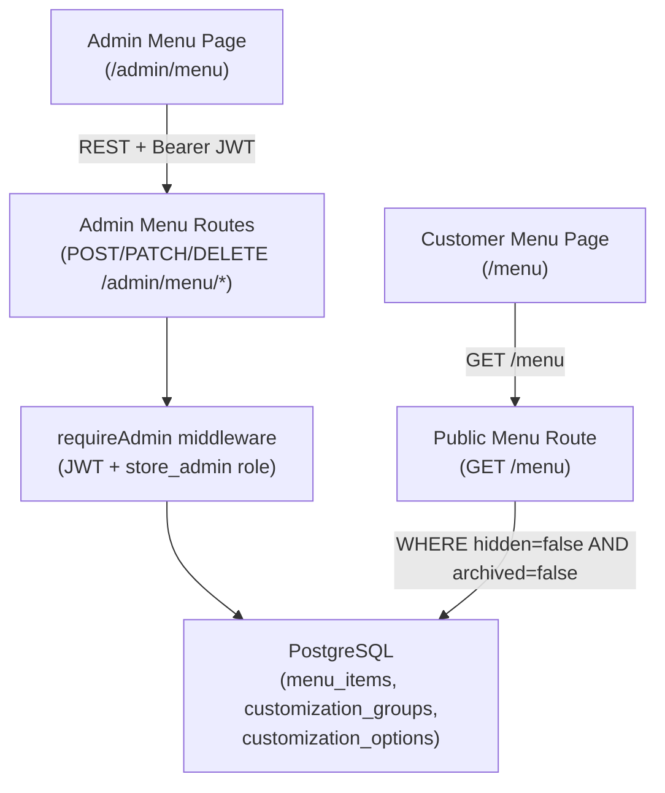

# Design Document: Seasonal Menu Management

## Overview

This feature adds a full CRUD admin interface for menu management, allowing Store_Admin to create, edit, hide, archive, and delete menu items and their customization groups/options — all without a code deploy or direct database access. Changes are immediately reflected on the customer-facing menu.

The implementation extends the existing Express/TypeScript backend with new routes under `/admin/menu`, updates the public `GET /menu` route to filter hidden/archived items, and adds a new React admin UI at `/admin/menu`.

Key design decisions:
- A single migration adds `hidden` and `archived` boolean columns to `menu_items` (the `sort_order` columns already exist on `customization_groups` and `customization_options` per the base schema)
- All admin write endpoints reuse the existing `requireAdmin` middleware
- The public menu filter is a pure SQL `WHERE` clause addition — no caching layer, so changes are immediately consistent
- Frontend state is managed with local React state + optimistic updates (same pattern as `SlotCapacityPage`)

---

## Architecture



**Data flow for admin changes:**
1. Store_Admin submits a form in the Admin Menu Page
2. The request hits an `/admin/menu/*` route, validated by `requireAdmin`
3. The route executes a parameterized SQL query against PostgreSQL
4. The response returns the updated resource
5. The frontend updates local state optimistically — no full page reload

**Public menu consistency:**
The `GET /menu` query gains a `WHERE mi.hidden = false AND mi.archived = false` clause. Since there is no caching layer, every customer request reads the current database state.

---

## Components and Interfaces

### Backend Routes

All write routes require `requireAdmin` middleware (401 if no JWT, 403 if non-admin role).

| Method | Path | Description |
|--------|------|-------------|
| GET | `/admin/menu/items` | List all items (including hidden/archived), ordered by category then name |
| POST | `/admin/menu/items` | Create a new menu item |
| PATCH | `/admin/menu/items/:id` | Update item fields (name, description, basePrice, category) |
| PATCH | `/admin/menu/items/:id/in-stock` | Toggle in-stock status |
| PATCH | `/admin/menu/items/:id/hidden` | Set hidden status |
| PATCH | `/admin/menu/items/:id/archived` | Set archived status |
| DELETE | `/admin/menu/items/:id` | Permanently delete item (cascades to groups/options) |
| GET | `/admin/menu/items/:id/groups` | List customization groups for an item, ordered by sort_order |
| POST | `/admin/menu/items/:id/groups` | Add a customization group |
| PATCH | `/admin/menu/groups/:id` | Update a customization group |
| DELETE | `/admin/menu/groups/:id` | Delete a group (cascades to options) |
| POST | `/admin/menu/groups/:id/options` | Add a customization option |
| PATCH | `/admin/menu/options/:id` | Update a customization option |
| DELETE | `/admin/menu/options/:id` | Delete a customization option |

### Frontend Components

```
client/src/components/Admin/Menu/
  MenuAdminPage.tsx          # Main page at /admin/menu — item list grouped by category
  MenuItemForm.tsx           # Reusable create/edit form for a menu item
  MenuItemRow.tsx            # Single item row with toggle controls and action buttons
  CustomizationGroupPanel.tsx # Expandable panel showing groups + options for an item
  CustomizationGroupForm.tsx  # Create/edit form for a customization group
  CustomizationOptionForm.tsx # Create/edit form for a customization option
  DeleteConfirmDialog.tsx     # Reusable confirmation dialog for destructive actions
```

### TypeScript Interfaces

New interfaces added to `backend/src/types/menu.ts` and mirrored in the frontend:

```typescript
// Extended public-facing types (hidden/archived not exposed to customers)
export interface MenuItem {
  id: string;
  name: string;
  description: string;
  basePrice: number;
  category: "drinks" | "food" | "extras";
  inStock: boolean;
  customizations: CustomizationGroup[];
}

// Admin-only extended type
export interface AdminMenuItem extends MenuItem {
  hidden: boolean;
  archived: boolean;
}

export interface AdminCustomizationGroup {
  id: string;
  menuItemId: string;
  label: string;
  required: boolean;
  sortOrder: number;
  options: AdminCustomizationOption[];
}

export interface AdminCustomizationOption {
  id: string;
  customizationGroupId: string;
  label: string;
  priceDelta: number;
  sortOrder: number;
}

// Request body shapes
export interface CreateMenuItemBody {
  name: string;
  description?: string;
  basePrice: number;        // non-negative integer cents
  category: "drinks" | "food" | "extras";
}

export interface UpdateMenuItemBody {
  name?: string;
  description?: string;
  basePrice?: number;
  category?: "drinks" | "food" | "extras";
}

export interface CreateGroupBody {
  label: string;
  required: boolean;
  sortOrder: number;
}

export interface CreateOptionBody {
  label: string;
  priceDelta: number;       // integer cents, may be negative
  sortOrder: number;
}
```

---

## Data Models

### Database Migration

A new migration file `009_menu_admin.sql` adds the two new columns to `menu_items`. The `sort_order` columns already exist on `customization_groups` and `customization_options` in the base schema.

```sql
-- Migration 009: Add hidden and archived columns to menu_items
-- Requirements: 5.2, 5.3, 6.2, 6.3, 11.1, 11.2

ALTER TABLE menu_items
  ADD COLUMN IF NOT EXISTS hidden   BOOLEAN NOT NULL DEFAULT false,
  ADD COLUMN IF NOT EXISTS archived BOOLEAN NOT NULL DEFAULT false;

-- Index for the common public menu filter
CREATE INDEX IF NOT EXISTS menu_items_visible_idx
  ON menu_items (hidden, archived)
  WHERE hidden = false AND archived = false;
```

### Updated Schema Summary

**menu_items** (additions only)
```
hidden    BOOLEAN NOT NULL DEFAULT false
archived  BOOLEAN NOT NULL DEFAULT false
```

**customization_groups** (already has sort_order per base schema)
```
sort_order  INTEGER NOT NULL DEFAULT 0
```

**customization_options** (already has sort_order per base schema)
```
sort_order  INTEGER NOT NULL DEFAULT 0
```

### Updated Public Menu Query

The existing `GET /menu` query gains a filter clause:

```sql
FROM menu_items mi
WHERE mi.hidden = false AND mi.archived = false
LEFT JOIN customization_groups cg ON cg.menu_item_id = mi.id
...
```

### Admin List Query

The admin list query returns all items regardless of flags:

```sql
SELECT id, name, description, base_price, category,
       in_stock, hidden, archived
FROM menu_items
ORDER BY category ASC, name ASC
```

### Validation (Zod schemas, backend)

```typescript
const createMenuItemSchema = z.object({
  name: z.string().min(1),
  description: z.string().optional().default(""),
  basePrice: z.number().int().nonnegative(),
  category: z.enum(["drinks", "food", "extras"]),
});

const updateMenuItemSchema = createMenuItemSchema.partial();

const createGroupSchema = z.object({
  label: z.string().min(1),
  required: z.boolean(),
  sortOrder: z.number().int().nonnegative(),
});

const createOptionSchema = z.object({
  label: z.string().min(1),
  priceDelta: z.number().int(),   // may be negative
  sortOrder: z.number().int().nonnegative(),
});
```

---

## Correctness Properties

*A property is a characteristic or behavior that should hold true across all valid executions of a system — essentially, a formal statement about what the system should do. Properties serve as the bridge between human-readable specifications and machine-verifiable correctness guarantees.*

### Property 1: Public menu excludes hidden and archived items

*For any* set of menu items with varying `hidden` and `archived` flags, the public menu filter function should return only items where both `hidden = false` and `archived = false` — no hidden or archived item should appear in the result.

**Validates: Requirements 5.4, 6.3, 11.1, 11.2**

---

### Property 2: Public menu preserves inStock field

*For any* set of visible (non-hidden, non-archived) menu items with varying `inStock` values, the public menu response should include each item with its `inStock` field accurately reflecting the stored value.

**Validates: Requirements 4.5, 11.3**

---

### Property 3: Admin list includes all items regardless of flags

*For any* set of menu items including those with `hidden = true` or `archived = true`, the admin list function should return all items — none should be filtered out.

**Validates: Requirements 1.1, 1.4**

---

### Property 4: Admin list sort order

*For any* list of menu items, the admin list sort function should produce a list where items are ordered by `category` ascending, then by `name` ascending within each category — no items are lost or duplicated.

**Validates: Requirements 1.4**

---

### Property 5: Created item has correct defaults

*For any* valid create payload (name, description, basePrice, category), the item creation function should produce an item with `inStock = true`, `hidden = false`, and `archived = false` regardless of what other fields were provided.

**Validates: Requirements 2.2**

---

### Property 6: Menu item validation rejects invalid inputs

*For any* create or update payload with a missing name, invalid category, or non-non-negative-integer basePrice, the validation function should reject the input and return a non-empty list of validation errors.

**Validates: Requirements 2.4, 2.5, 2.6, 2.7, 3.4, 3.5**

---

### Property 7: Hide/unhide round-trip

*For any* menu item, hiding it (setting `hidden = true`) and then unhiding it (setting `hidden = false`) should return the item to its original `hidden = false` state.

**Validates: Requirements 5.2, 5.3**

---

### Property 8: Archive/restore round-trip

*For any* menu item, archiving it (setting `archived = true`) and then restoring it (setting `archived = false`) should return the item to its original `archived = false` state.

**Validates: Requirements 6.2, 6.5**

---

### Property 9: Sort order display for groups and options

*For any* list of customization groups (or options), the display sort function should produce a list ordered by `sortOrder` ascending — no items lost or duplicated.

**Validates: Requirements 8.1, 9.1**

---

### Property 10: Price delta validation rejects non-integers

*For any* option create or update payload where `priceDelta` is not an integer (e.g., a float, a string, or undefined), the validation function should reject the input.

**Validates: Requirements 9.9**

---

## Error Handling

### Not Found (404)

All routes that operate on a specific resource by ID (`PATCH /admin/menu/items/:id`, `DELETE /admin/menu/items/:id`, etc.) return `404` with a descriptive message if the resource does not exist.

### Validation Errors (400)

Zod schema validation runs before any database query. Invalid payloads return `400` with a structured error listing the failing fields. The frontend also validates before submitting, so the 400 path is a safety net for direct API calls.

### Auth Errors

- Missing or invalid JWT → `401 UNAUTHORIZED` (from `requireAdmin`)
- Valid JWT but non-admin role → `403 FORBIDDEN` (from `requireAdmin`)
- Frontend: unauthenticated users navigating to `/admin/menu` are redirected to the login page

### Cascade Delete Safety

`DELETE /admin/menu/items/:id` relies on PostgreSQL `ON DELETE CASCADE` constraints already defined in the base schema. No application-level loop is needed. The route returns `404` if the item does not exist.

### Concurrent Edits

No optimistic locking is implemented for MVP. Last-write-wins semantics apply. The admin UI is single-user in practice (one Store_Admin).

### Public Menu Filter Errors

If the database query for `GET /menu` fails, the existing error handler middleware returns `500`. No partial results are returned.

---

## Testing Strategy

### Property-Based Testing

**Library**: [fast-check](https://github.com/dubzzz/fast-check) (already used in the project)

**Configuration**: Minimum 100 runs per property test (`numRuns: 100`).

Tag format: `// Feature: seasonal-menu-management, Property N: <property_text>`

New test file: `backend/src/services/__tests__/menuAdmin.property.test.ts`

| Property | Function Under Test | Generator |
|----------|--------------------|-----------| 
| P1: Public menu excludes hidden/archived | `filterPublicItems(items)` | Random items with varying hidden/archived flags |
| P2: Public menu preserves inStock | `filterPublicItems(items)` | Random visible items with varying inStock |
| P3: Admin list includes all items | `listAdminItems(items)` | Random items including hidden/archived |
| P4: Admin list sort order | `sortAdminItems(items)` | Random items with varying category/name |
| P5: Created item has correct defaults | `applyCreateDefaults(payload)` | Random valid create payloads |
| P6: Validation rejects invalid inputs | `validateMenuItemPayload(payload)` | Random invalid payloads (missing name, bad price, bad category) |
| P7: Hide/unhide round-trip | `toggleHidden(item, value)` | Random items |
| P8: Archive/restore round-trip | `toggleArchived(item, value)` | Random items |
| P9: Sort order for groups/options | `sortByOrder(items)` | Random groups/options with varying sortOrder |
| P10: Price delta validation | `validateOptionPayload(payload)` | Random non-integer priceDelta values |

### Unit / Example Tests

Focus on specific scenarios not covered by property tests:

- `GET /admin/menu/items` returns 401 without JWT, 403 with non-admin JWT
- `POST /admin/menu/items` with valid payload creates item with correct defaults
- `PATCH /admin/menu/items/:id` with non-existent ID returns 404
- `DELETE /admin/menu/items/:id` with non-existent ID returns 404
- `GET /menu` excludes hidden items after a hide operation
- `GET /menu` excludes archived items after an archive operation
- Admin UI redirects unauthenticated users to login
- Delete confirmation dialog appears before submitting delete request

### Integration Tests

- Full item lifecycle: create → edit → hide → unhide → archive → restore → delete
- Cascading delete: deleting an item removes its groups and options
- Public menu consistency: admin change immediately reflected on next `GET /menu` call

### Smoke Tests

- Migration 009 applies cleanly against the existing schema
- All existing `GET /menu` consumers continue to work after the filter addition (no breaking change to response shape)
